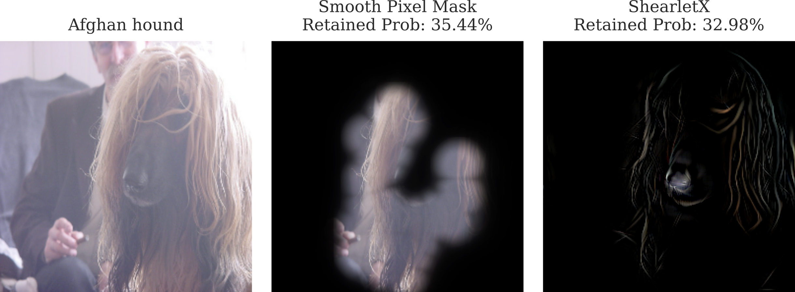
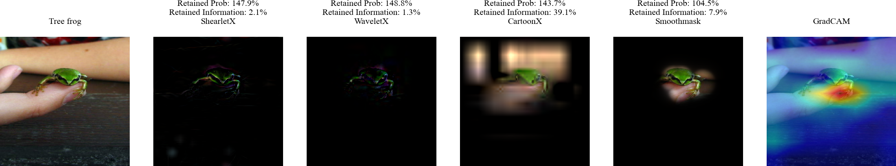
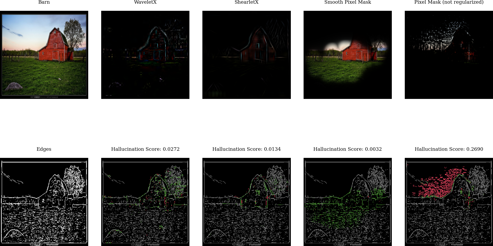

<div align="center">
	<a href = "https://arxiv.org/pdf/2211.12857.pdf">
        Paper Title: Explaining Image Classifiers with Multiscale Directional Image Representation
<div><p>Authors: Stefan Kolek, Robert Windesheim, Hector Andrade Loarca, Gitta Kutyniok, Ron Levie<br>Conference: CVPR 2023</p></div>

</div>

# Paper Contributions
Popular explanation methods such as <a href="https://arxiv.org/pdf/1610.02391.pdf">GradCAM</a>
 or <a href="https://arxiv.org/pdf/1910.08485.pdf">Extremal Perturbations (smooth pixel space masks)</a> produce overly smooth explanations that can only produce very rough localizations of relevant image  regions. We introduce <u>ShearletX</u> and <u>WaveletX</u>, two new mask explanation methods for image classifiers that are able to overcome this limitation and seperate classifier relevant fine details in images without creating explanation artifacts. We also provide the first theoretical analysis and metrics for explanation artifacts of mask explanations. Moreover, we introduce Conciseness-Preciseness (CP) scores as a new metric for mask explanation goodness to measure the fidelity of a mask explanation adjusted for its conciseness.
<details closed>
<summary>ShearletX</summary>
ShearletX optimizes an explanation mask on the shearlet representation of the input image to extract the classifier relevant parts of the image. The optimization objective aims for a sparse shearlet mask, penallizes energy in the spatial domain of the explanation, and requires that the masked image approximately produces the same output as the unmasked image.

</details>
    
<details closed>
<summary>WaveletX</summary>
WaveletX differes from ShearletX only in that wavelets instead of sheralets are used.
WaveletX is very similar to <a href="https://www.ecva.net/papers/eccv_2022/papers_ECCV/papers/136720439.pdf">CartoonX</a> but uses a spatial penalty term that resolves spatial ambiguities in CartoonX.

</details>

<details closed>
<summary>Explanation Artifacts</summary>
   We characterize explanation artifacts as artificial edges, i.e., edges in the masked image that do not occur in the original image. Such artificial edges can form hallucinated patterns that activate a class label but do not explain the actual classification decision. We quantify the artificial edges with a new metric that we call Hallucination Score.
</details>
    
<details closed>
<summary>CP-Scores</summary>
We introduce the conciseness-preciseness (CP) scores as a new information theoretic metric to evaluate the goodness of mask explanations. CP scores measure the fidelity of the explanation adjusted for their conciseness.   
</details>


# Setup
Python 3.7.x and newer are supported:

```shell
# clone project   
git clone https://github.com/skmda37/CartoonX.git 

# Enter directocry
cd CartoonX 

# Create and activate virtual environment (or conda environment)
python -m venv env
source env/bin/activate   

# install pytorch wavelets package (see https://pytorch-wavelets.readthedocs.io/en/latest/readme.html for the docs)
git clone https://github.com/fbcotter/pytorch_wavelets
cd pytorch_wavelets
pip install .
pip install -r tests/requirements.txt
pytest tests/
cd ..

# install other project dependencies from requirements file   
pip install -r requirements.txt
```   
    

# Contents
<div>
<ol>
		<li> <code><a href = "./code/">code/</a></code>: Contains the code to use ShearletX and WaveletX, and reproducing the paper experiments.</li>
		<li> <code><a href = "./imgs/">imgs/</a></code>: Contains all images for this README.md.</li>
	</ol>
</div>

# How to Run?

First, do <code>cd <a href = "./code/">code/</a></code>. Then you can either:
<div>
	<ol>
		<li> Explain models with ShearletX and WaveletX in <code><a href = "./code/visualize_example_explanations.ipynb">visualize_example_explanations.ipynb</a> </code></li>
        <br>
        <div style="text-align: center;">
        
        </div>
        <br>
		<li> Visualize explanation artifacts in <code><a href = "./code/visualize_explanation_artifacts.ipynb">visualize_explanation_artifacts.ipynb</a></code></li>
        <br>
        <div style="text-align: center;">
        
        </div>
        <br>
        <li> Reproduce the scatterplot experiments from Figure 4 by running 
            <code>python <a href = "./code/scatterplot.py">scatterplot.py</a></code>. This will produce the scatterplots with the following different settings that were used in the paper:
            <ul>
                <li> Model: <code>Resnet18</code>, <code>VGG19</code>, or <code>MobilenetV3</code></li>
                <li> Area size for Smoothmask: <code>0.05</code>, <code>0.1</code>, <code>0.2</code></li>
            </ul>
            The scatterplots will be saved in the folder <code>./code/scatterplot_figures</code>.
	</ol>
</div>


# Cite
```bibtex
@inproceedings{kolek2023explaining,
  title={Explaining Image Classifiers with Multiscale Directional Image Representation},
  author={Kolek, Stefan and Windesheim, Robert and Andrade Loarca, Hector and Kutyniok, Gitta and Levie, Ron},
  booktitle={Proceedings of the IEEE Conference on Computer Vision and Pattern Recognition (CVPR)},
  year={2023},
  organization={IEEE}
}

```
# License
<div>
<a rel="license" href="http://creativecommons.org/licenses/by-nc/4.0/"></a><br />This work is licensed under a <a rel="license" href="http://creativecommons.org/licenses/by-nc/4.0/">Creative Commons Attribution-NonCommercial 4.0 International License</a>.
</div>
