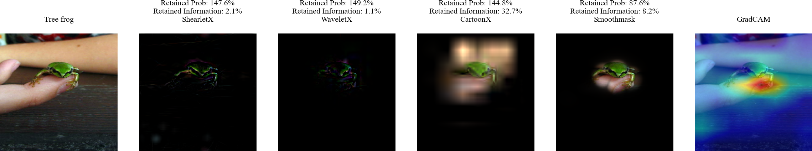

<div align="center">
	<a href = "https://arxiv.org/pdf/2211.12857.pdf">
        Paper Title: Explaining Image Classifiers with Multiscale Directional Image Representation
		<!-- -->
		
<div><p>Authors: Stefan Kolek, Robert Windesheim, Hector Andrade Loarca, Gitta Kutyniok, Ron Levie<br>Conference: CVPR 2023</p></div>
</div>

# Paper Summary
<details open>
<summary>ShearletX</summary>
    

</details>
    
<details open>
<summary>WaveletX</summary>
    

</details>

<details open>
<summary>Explanation Artifacts</summary>
    

</details>
    
<details open>
<summary>CP-Scores</summary>
    </details>


# Setup
Python 3.8.x and newer are supported:

<details>
	<summary>Automated Setup</summary>
	<ol>
		<li> Create a virtualenv at the root of the repo: <code>python -m venv venv4coshnet</code> </li>
		<li> Activate venv4coshnet:
			<ul>
				<li> Windows: <code>venv4coshnet\Scripts\activate</code> </li>
				<li> Linux/MacOS: <code>source venv4coshnet/bin/activate</code> </li>
			</ul> 
		</li>
		<li> Run setup.py:
			<ul>
				<li> with <code>CUDA</code>: <code>python <a href = "./setup.py">setup.py</a></code> </li>
				<li> without <code>CUDA</code>: <code>python <a href = "./setup.py">setup.py</a> --no-cuda</code> </li>
				<li> use <code>--no-venv</code> to disable venv check (e.g. inside a docker) </li>
			</ul>
		</li>	
	</ol>

</details>

<details>
	<summary>Manual Setup</summary>
	<ul>
		<li> Please follow: <code><a href = "./setup.txt">setup.txt</a></code></li>
	</ul>
</details>

<details>
	<summary>Docker Setup</summary>
	<ul>
		<li> Build image: <code>docker build -t coshnet-docker:latest .</code> (Some systems might require running this in `sudo` mode.)</li>
	</ul>
</details>

# Contents
<div>
<ol>
		<li> <code><a href = "./code/">code/</a></code>: Contains the code to use ShearletX and WaveletX, and reproducing the paper experiments.</li>
		<li> <code><a href = "./imgs/">libs/</a></code>: Contains all images for this README.md.
						   (Installed automatically in setup.txt)</li>
		<li> <code><a href = "./data/">data/</a></code>: Folder where datasets are present. Created automatically when running for first time.</li>
	</ol>
</div>

# How to Run?

First, do <code>cd <a href = "./code/">code/</a></code>. Then you can either:
<div>
	<ol>
		<li> Explain models with ShearletX and WaveletX in <code> <a href = "./code/visualize_example_explanations.ipynb">visualize_example_explanations.ipynb</a> </code></li>
        <br>
        <div>
        
        </div>
		<li> Visualize explanation artifacts in <code> <a href = "./code/visualize_explanation_artifacts.ipynb">visualize_explanation_artifacts.ipynb</a></code></li>
        <br>
        <div>
        
        </div>
        <li> Reproduce the scatterplot experiments from Figure 4 by running 
            <code>python <a href = "./code/scatterplot.py">scatterplot.py</a></code>. This will produce the scatterplots with the following different settings that were used in the paper:
            <ul>
                <li> Model: <code>Resnet18</code>, <code>VGG19</code>, or <code>MobilenetV3</code></li>
                <li> Area size for Smoothmask: <code>0.05</code>, <code>0.1</code>, <code>0.2</code></li>
            </ul>
            The scatterplots will be saved in the folder <code>./code/scatterplot_figures</code>.
	</ol>
</div>


# Cite
```bibtex
@inproceedings{kolek2023explaining,
  title={Explaining Image Classifiers with Multiscale Directional Image Representation},
  author={Kolek, Stefan and Windesheim, Robert and Andrade Loarca, Hector and Kutyniok, Gitta and Levie, Ron},
  booktitle={Proceedings of the IEEE Conference on Computer Vision and Pattern Recognition (CVPR)},
  year={2023},
  organization={IEEE}
}

```
# License
<div>
<a rel="license" href="http://creativecommons.org/licenses/by-nc/4.0/"></a><br />This work is licensed under a <a rel="license" href="http://creativecommons.org/licenses/by-nc/4.0/">Creative Commons Attribution-NonCommercial 4.0 International License</a>.
</div>
